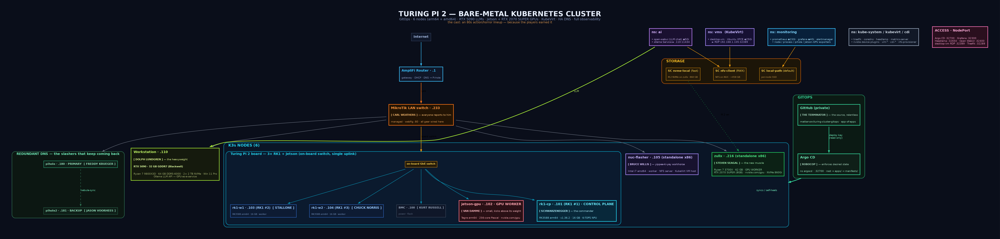
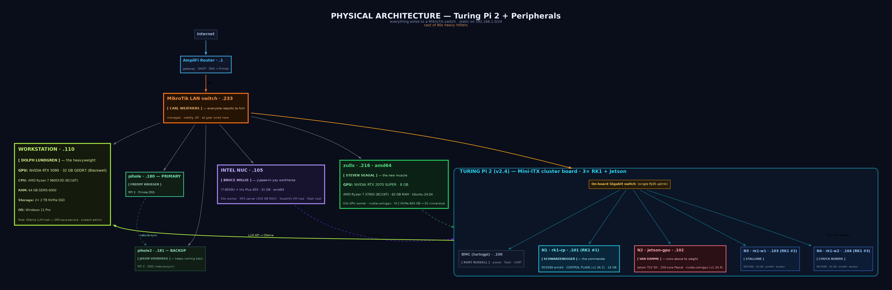

# Turing Pi 2 — Bare-Metal Kubernetes Cluster


-326CE5?logo=kubernetes&logoColor=white)


> A five-node, mixed-architecture Kubernetes cluster on a **Turing Pi 2** board + an **Intel NUC** —
> serving local LLMs off an **RTX 5090**, running real **VMs**, doing **GPU compute** on a Jetson,
> blocking ads for the whole house with **redundant Pi-hole DNS**, and fully instrumented with
> **Prometheus/Grafana** — every bit of it declaratively managed by **Argo CD** from this repo.

This repository is the **GitOps source of truth**: push a manifest, Argo reconciles the cluster.
Credentials live only in the local build doc and are never committed here.

**Full architecture reference (every component, wiring, placement): [docs/ARCHITECTURE.md](docs/ARCHITECTURE.md)**

---

## Highlights

- **Mixed-arch K3s** — 3× ARM64 Rockchip modules + 1× ARM64 NVIDIA Jetson + 1× x86-64 Intel NUC, one cluster.
- **GitOps** — Argo CD (app-of-apps) reconciles everything from this git repo.
- **GPU-as-a-service** — an RTX 5090 (32 GB) serves local LLMs (Ollama + Open WebUI) to the cluster without being a node.
- **Schedulable Jetson GPU** — `nvidia.com/gpu` workloads (CUDA compute, raytracing, fractals) on the Tegra.
- **Second GPU node (`zullx`)** — an AMD Ryzen / **RTX 2070 SUPER** box joined as a K3s GPU worker (62 GB RAM) with its **1 TB M.2 NVMe as fast cluster storage** (`nvme-local`).
- **Real VMs** — KubeVirt runs a full Linux desktop alongside containers, reachable over **RDP at `192.168.1.105:32389`**.
- **Redundant DNS** — primary + backup Pi-hole, auto-synced nightly, LAN-wide ad-blocking.
- **458 GB shared storage** — NFS RWX served from the NUC to the whole cluster.
- **Full observability** — Prometheus, Grafana, Alertmanager, per-host + per-process + GPU metrics.



---

## Hardware

### Compute — the Turing Pi 2 board

The **Turing Pi 2 (v2.4)** is a Mini-ITX carrier board with **4 node slots**, an on-board Gigabit
switch (single RJ45 uplink), and a **BMC** (baseboard management controller) for power/flashing.

| # | Module | Silicon | Cores / GPU | RAM | Purpose & capability |
|---|--------|---------|-------------|-----|----------------------|
| — | **Turing Pi 2 board** (BMC `.100`) | BMC fw 2.0.5 | on-board GbE switch | — | Carrier + out-of-band mgmt: per-node power, USB routing, flashing, UART. |
| N1 | **RK1** · `rk1-cp` `.101` | Rockchip RK3588 | 8-core (4×A76+4×A55) · 6-TOPS NPU | 16 GB | **K3s control plane** — API server, scheduler, etcd; runs the monitoring stack. |
| N2 | **Jetson TX2 NX** · `jetson-gpu` `.102` | NVIDIA Tegra186 (Parker) | 6-core CPU · **256-core Pascal GPU (CC 6.2)** | 4 GB | **GPU worker** — CUDA compute; advertises `nvidia.com/gpu`; runs raytracer/fractal renders. |
| N3 | **RK1** · `rk1-w1` `.103` | Rockchip RK3588 | 8-core · 6-TOPS NPU | 16 GB | General ARM64 worker. |
| N4 | **RK1** · `rk1-w2` `.104` | Rockchip RK3588 | 8-core · 6-TOPS NPU | 16 GB | General ARM64 worker. |

### Supporting infrastructure

| Device | Silicon | Specs | Purpose & capability |
|--------|---------|-------|----------------------|
| **Intel NUC** · `nuc-flasher` `.105` | Intel **i7-8559U** + Iris Plus 655 iGPU | 4c/8t · 31 GB RAM · ~931 GB + 465 GB SSD | The x86 workhorse: **amd64 K3s worker**, **NFS server** (458 GB RWX pool), **KubeVirt VM host**, and **Jetson flash host**. iGPU does QuickSync decode + OpenVINO. |
| **Workstation** · `.110` | AMD **9800X3D** + **RTX 5090 (32 GB, Blackwell)** | 64 GB DDR5-6000 | **GPU-as-a-service**: runs Ollama on the LAN so the cluster gets local LLM inference (~208 tok/s on llama3.1:8b) without the rig being a node. Also the kubectl/admin box. |
| **Raspberry Pi 3** · `pihole` `.180` | BCM2837 (quad A53) | 1 GB · Debian 13 | **Pi-hole DNS — PRIMARY**. Network-wide ad/tracker blocking (~319k domains). |
| **Raspberry Pi 3** · `pihole2` `.181` | BCM2837 (quad A53) | 1 GB · Debian 13 | **Pi-hole DNS — BACKUP**. Auto-synced from primary nightly (nebula-sync); DNS survives a Pi failure. |
| **zullx** · `.216` | AMD **Ryzen 7 3700X** (8C/16T) + **RTX 2070 SUPER (8 GB)** | 62 GB RAM · 1 TB SATA (OS) + 1 TB NVMe | **x86 K3s GPU worker** — `nvidia.com/gpu` scheduling (CUDA/Stable Diffusion/TensorRT); its **M.2 NVMe** is the `nvme-local` StorageClass (fast PVCs). Ubuntu 24.04. |
| **AmpliFi router** · `.1` | — | — | Gateway + DHCP; hands out both Pi-holes as DNS. |

---

## Platform stack

| Layer | What runs it |
|-------|--------------|
| **Orchestration** | K3s v1.36.2 (Jetson on v1.34.9 — kernel 4.9 / cgroup v1) |
| **GitOps** | Argo CD (app-of-apps) — this repo is the source of truth |
| **Ingress** | Traefik (k3s built-in) + NodePort services |
| **Storage** | local-path (per-node SSD) + `nfs-client` RWX (NFS from the NUC, ~458 GB) |
| **GPU scheduling** | `nvidia.com/gpu` — squat generic-device-plugin (Jetson) + official NVIDIA device plugin (zullx, RTX 2070 SUPER) |
| **AI / LLM** | Ollama on the RTX 5090 + Open WebUI (ns `ai`) |
| **Virtualization** | KubeVirt + CDI — full VMs (ns `kubevirt`/`cdi`/`vms`) |
| **DNS** | Pi-hole v6 ×2 (HA, nebula-sync) |
| **Observability** | kube-prometheus-stack + node/process/Pi-hole/Jetson-GPU exporters |
| **Cluster UI** | Headlamp |

---

## Access & endpoints

Reachable on any node IP (e.g. `.101`); remotely via the Tailscale subnet router.

| Endpoint | Address | What |
|----------|---------|------|
| **KubeVirt desktop VM** | **`192.168.1.105:32389`** (RDP) | Full Ubuntu XFCE desktop VM (ns `vms`) |
| Open WebUI | `192.168.1.101:32400` | LLM chat, backed by the RTX 5090 |
| Grafana | `192.168.1.101:32300` | Metrics dashboards |
| Argo CD | `192.168.1.101:32700` | GitOps UI |
| Headlamp | `192.168.1.101:32650` | Kubernetes UI |
| Kubernetes API | `192.168.1.101:6443` | `kubectl` |
| Traefik ingress | `:32289` (web) / `:30145` (websecure) | Cluster ingress |

---

## What it can do

- **Run local LLMs** — chat via Open WebUI, backed by the 5090; models on demand via Ollama.
- **Run VMs next to containers** — a full XFCE Linux desktop over RDP, disk on shared NFS.
- **GPU compute on the edge** — schedule CUDA jobs on the Jetson (see the raytracer/fractal renderer).
- **Serve & protect the whole LAN** — redundant ad-blocking DNS that fails over automatically.
- **See everything** — btop-style per-host, per-process, and GPU/thermal metrics in Grafana.
- **Rebuild itself from git** — the cluster's desired state is declarative and version-controlled.

---

## Physical architecture



---

## By the numbers

- **6** nodes · **2** CPU architectures (arm64 + amd64)
- **~42** CPU cores · **~145 GB** cluster RAM
- **3** GPUs in play (RTX 5090 as a service + Jetson Pascal + **RTX 2070 SUPER on zullx**) · **3× 6-TOPS NPUs** aboard the RK1s
- **458 GB** RWX NFS **+ 860 GB** fast NVMe (`nvme-local`) · **9** namespaces
- **7** always-on services exposed (Argo CD, Grafana, Headlamp, Open WebUI, RDP, Traefik web/websecure)

---

## This repo (GitOps)

```
bootstrap/root.yaml     app-of-apps root; watches apps/ (recurse=false)
apps/                   Argo Applications that ARE synced (one file per app)
manifests/<app>/        raw Kubernetes YAML each app deploys
staged/                 Applications declared but NOT yet synced (adoption backlog)
docs/                   ARCHITECTURE.md + topology & architecture diagrams (+ .dot sources)
```

**Under Argo control now:** `gpu-device-plugin` (Jetson) · `ollama-endpoint` (5090 LLM Service) · `gpu-device-plugin-x86` (zullx RTX 2070 SUPER) · `nvme-storage` (zullx `nvme-local` SC + PV).
The rest of the cluster is inventoried in [`staged/`](staged/) for safe, incremental adoption.

**Add an app:** drop manifests in `manifests/<app>/`, add an `Application` in `apps/<app>.yaml`, `git push` — Argo syncs it.

**Regenerate diagrams:** `dot -Tpng docs/topology.dot -o docs/topology.png -Gdpi=150`

## Secrets policy

No plaintext credentials in this repo. Secret-bearing apps are adopted only after Sealed/External
Secrets is in place, or their Secrets stay applied out-of-band.
